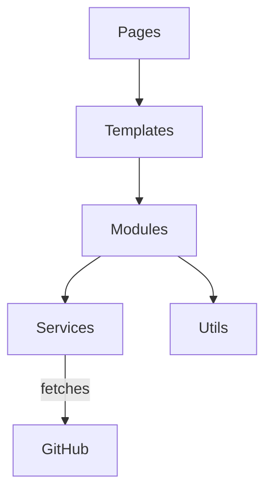

# Architecture

This repository builds a portfolio site using modular TypeScript utilities and Webpack.

- **Pages** define top-level page configuration.
- **Templates** render markup and styles.
- **Modules** contain reusable logic like filtering and sorting.
- **Services** communicate with external APIs such as GitHub.
- **Utils** provide small helper functions.
